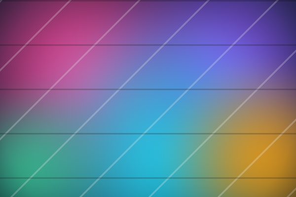
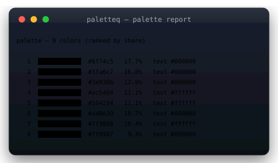
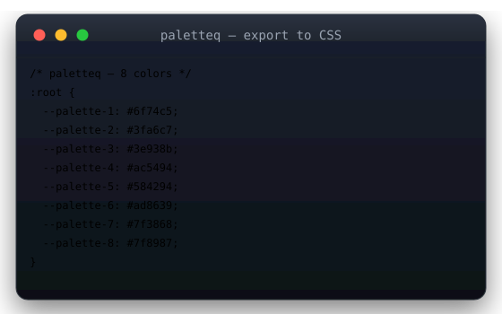

<div align="center">


# paletteq

**Extract gorgeous color palettes from any image — right in your terminal.**

[](https://www.npmjs.com/package/paletteq)
[](https://github.com/v01dst/paletteq/actions/workflows/ci.yml)
[](LICENSE)


</div>

## ✨ Why paletteq?

You want a palette from a screenshot, a logo, a photo. You don't want to open an editor, upload your image to some website, or install a native image library that breaks your build.

paletteq is a **pure TypeScript** PNG decoder + **k-means++** palette extractor in a single zero-dependency package. It works as a **CLI** and as a **library**, is fully **deterministic** (seeded PRNG → same image, same palette, forever), and exports to **5 formats** your tools actually consume.

- 🚀 **Zero dependencies** — no canvas, no sharp, no wasm. ~40 KB installed.
- 🎯 **Deterministic** — k-means++ with a seeded PRNG; reproducible palettes for CI/design systems.
- 📦 **CLI + library** — script it with Node, or one-shot it in your shell.
- 🎨 **5 export formats** — CSS custom properties, SCSS, Tailwind, JSON, SVG swatch sheet.
- 🧠 **Contrast-aware** — every color ships with a WCAG-recommended text foreground.
- ⚡ **Fast** — pixel sampling caps work at ~20k samples; large images still answer in milliseconds.

## 🖼️ Showcase

Sample input (`assets/demo-image.png`):



Run it:

```bash
paletteq demo-image.png -n 8
```



Export design tokens:

```bash
paletteq demo-image.png -f css
```



## 📦 Install

```bash
# CLI (global)
npm install -g paletteq

# Library
npm install paletteq

# One-shot, no install
npx paletteq photo.png
```

## 🚀 CLI usage

```bash
paletteq photo.png                    # 8-color palette table
paletteq photo.png -n 6               # exactly 6 colors
paletteq photo.png -f css             # :root custom properties
paletteq photo.png -f tailwind -o paletteq.tailwind.js
paletteq photo.png -f json --seed 7   # reproducible JSON
paletteq photo.png -f svg -o swatches.svg
```

Supported input: **PNG** (8-bit RGB / RGBA / grayscale / gray+alpha, non-interlaced).

## 🧩 Library API

```ts
import { extractPalette } from "paletteq";

const palette = await extractPalette(imageBuffer, { count: 6, seed: 42 });
// => [{ hex: "#ec4899", rgb: [236,72,153], population: 0.22, foreground: "#000000" }, ...]
```

`extractPalette(input, opts?)` accepts a `Uint8Array | Buffer` containing PNG data.

| Option   | Type     | Default | Description                              |
| -------- | -------- | ------- | ---------------------------------------- |
| `count`  | `number` | `8`     | Palette size (1–24)                      |
| `seed`   | `number` | `42`    | PRNG seed for k-means++ (determinism)    |

## 🎨 Formats

| Format     | Flag         | Produces                                       |
| ---------- | ------------ | ---------------------------------------------- |
| Table      | `-f table`   | ANSI truecolor swatches + share % + text color |
| CSS        | `-f css`     | `:root { --palette-1: #...; }`                 |
| SCSS       | `-f scss`    | `$palette-1: #...;`                            |
| Tailwind   | `-f tailwind`| `theme.extend.colors` snippet                  |
| JSON       | `-f json`    | full color objects (hex, rgb, share, fg)       |
| SVG        | `-f svg`     | labeled swatch grid you can paste in a README  |

## ⚙️ Options

| Flag                | Description                                  |
| ------------------- | -------------------------------------------- |
| `-n, --count <n>`   | number of colors (1–24, default 8)           |
| `-f, --format <f>`  | `table\|css\|scss\|tailwind\|json\|svg`      |
| `-o, --out <file>`  | write to file instead of stdout              |
| `--seed <n>`        | deterministic k-means++ seeding (default 42) |
| `--color[=MODE]`    | `always\|auto\|never`                        |
| `--no-color`        | disable ANSI colors                          |
| `-V, -h`            | version / help                               |

Env: `FORCE_COLOR=1` forces color, `NO_COLOR` disables it.

## 🧪 How it works

1. **Decode** — PNG chunk parsing, `zlib.inflate`, all five unfilter paths (None/Sub/Up/Average/Paeth), color-type conversion to RGB. CRC-validated with clear corruption errors.
2. **Sample** — stride-based pixel sampling, capped ~20k samples.
3. **Cluster** — k-means++ with mulberry32 seeded PRNG; converges ≤ 25 iterations.
4. **Rank** — clusters sorted by population share; WCAG relative luminance picks each color's readable foreground.

## 🛠️ Development

```bash
npm install
npm run build     # tsc → dist/
npm test          # build + fixtures + node:test suite (37 tests)
npm run fixtures  # regenerate deterministic PNG fixtures + demo image
```

## 🗺️ Roadmap

- [ ] JPEG support (pure-JS baseline decoder)
- [ ] `-- dominant` mode (largest region instead of clustering)
- [ ] Palette harmonies (complementary / analogous) from extracted base color
- [ ] `oklch` output space
- [ ] Apple Silicon + Windows release binaries via `pkg`

## 🤝 Contributing

PRs welcome — open an issue first for anything bigger than a typo. `npm test` must pass; keep the zero-dependency policy.

## 📄 License

[MIT](LICENSE) © 2026 v01dst
